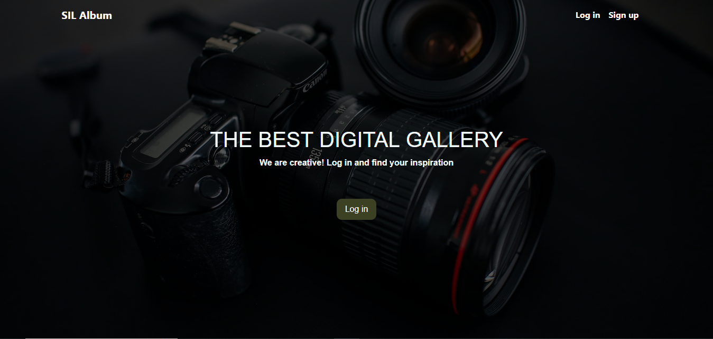
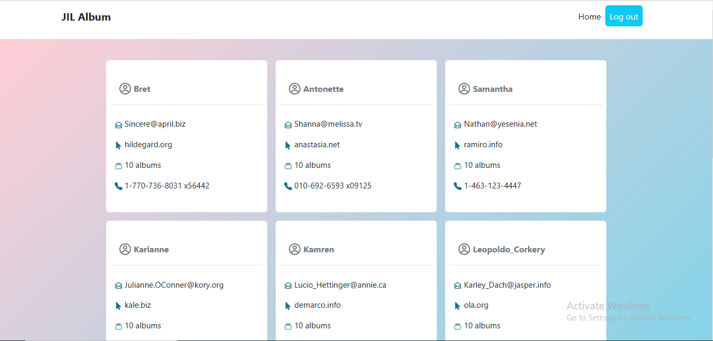

# Jil Album

"Jil album" is a webapp for displaying resources retrieved from [this API](https://jsonplaceholder.typicode.com/). 


  
  
  

### LiveLink
[Link](https://lighthearted-cascaron-2f0864.netlify.app/#/)

### Project Requirements
JIL Album project requirements

## Built With
- JS
- CSS
- React
- Redux-Saga
- Redux
- Bootstrap

## Getting Started

### Prerequisites

- Node.js

### Setup

Clone the project:

```
git clone https://github.com/blakbox23/album
```

### Run project

Install dependencies:

```
npm install
npm run dev
```

### Run tests

To run tests,

```
npm run test
```

## Author's

👤 **Peter Mbuthia** 

- GitHub: [@Blakbox23](https://github.com/blakbox23) 
- Twitter: [@blakbox23](https://twitter.com/blakbox23) 
- LinkedIn: [Peter Mbuthia](https://www.linkedin.com/in/peter-mbuthia) 

